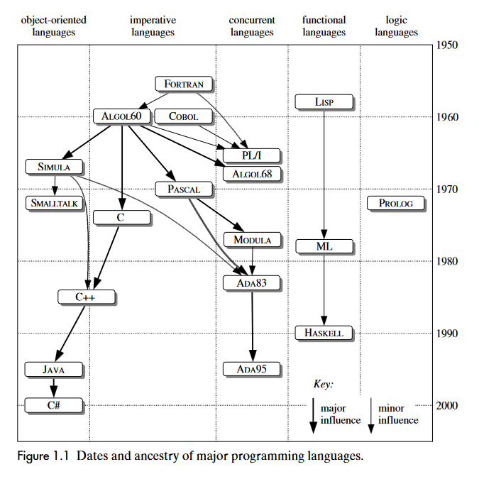

# Introdução
A seguir está uma breve introdução sobre as linguagens de programação: o que as compoõem e suas histórias.

> A sintaxe é importante, mas semântica e pragmática são ainda mais importantes

## Linguística de programação
### Sintaxe
A **sintaxe** influencia como os programas são escritos pelo programador, lidos por outros programadores e analisados pelo computador.

Portanto, a sintaxe é o arranjo de expressões, comandos, declarações e outras construções.

### Semântica
A **semântica** determina como os programas são compostos pelo programador, compreendidos por outros programadores e interpretados pelo computador.

Sendo assim, a semântica está relacionada ao significado do programa, ou seja, como se pode esperar que um programa bem formado se comporte quando executado em um computador.

### Pragmáticas
A **pragmática** influencia como se espera que os programadores projetem e implementem programas na prática.

Há uma preocupação com a maneira como a linguagem deve ser usada na prática

## Desenvolvimento histórico

- Programação Orientada à Objetos: baseada em classes e objetos.
- Programação Funcional: baseada em funções sobre tipos, como listas e árvores
- Programação Lógica: baseada em um subconjunto da lógica predicada